# Database schema (generated)

> **DO NOT EDIT.** Generated by `precis schema-doc` from the live database — regenerate with `scripts/gen-schema` rather than hand-editing, so it can't drift. The hand-drawn [`schema-v2.puml`](./schema-v2.puml) is the *conceptual* sketch; this is the *actual*.
>
> Source: precis_prod @ 2026-06-19 · 33 base tables · 31 foreign keys.

```mermaid
erDiagram
    _migrations {
        text version PK
        timestamp_with_time_zone applied_at
        text checksum
        text plugin PK
    }
    actors {
        text slug PK
        text description
        timestamp_with_time_zone created_at
    }
    app_state {
        text key PK
        text value
        timestamp_with_time_zone updated_at
    }
    artifact_kinds {
        text slug PK
        text target
        text storage
        text output_table
        text description
        timestamp_with_time_zone deprecated_at
        timestamp_with_time_zone created_at
    }
    cache_state {
        bigint ref_id PK
        text provider FK
        text request_hash
        text model
        timestamp_with_time_zone fetched_at
        timestamp_with_time_zone fresh_until
        numeric cost_usd
        jsonb meta
    }
    chunk_embeddings {
        bigint chunk_id PK
        text embedder PK
        USER_DEFINED vector
        text status
        integer attempts
        text last_error
        timestamp_with_time_zone created_at
    }
    chunk_kinds {
        text slug PK
        boolean is_card
        text description
        timestamp_with_time_zone deprecated_at
        timestamp_with_time_zone created_at
    }
    chunk_summaries {
        bigint chunk_id PK
        text summarizer PK
        text text
        character prompt_hash
        integer token_count
        text status
        integer attempts
        text last_error
        timestamp_with_time_zone created_at
    }
    chunk_tags {
        bigint chunk_id PK
        bigint tag_id PK
        text set_by FK
        timestamp_with_time_zone created_at
    }
    chunks {
        bigint chunk_id PK
        bigint ref_id FK
        text set_by FK
        integer ord
        text chunk_kind FK
        text text
        ARRAY block_ids
        integer token_count
        ARRAY section_path
        integer page_first
        integer page_last
        jsonb meta
        tsvector tsv
        timestamp_with_time_zone created_at
        ARRAY numerics
        ARRAY keywords
        jsonb keywords_meta
        integer accesses
        timestamp_with_time_zone last_dreamt
        timestamp_with_time_zone last_seen
        timestamp_with_time_zone last_watched
    }
    claude_quota_snapshot {
        text scope PK
        timestamp_with_time_zone ts
        jsonb data
    }
    dream_log {
        bigint attempt_id PK
        timestamp_with_time_zone created_at
        text outcome
        ARRAY behaviors
        jsonb seed_clusters
        ARRAY result_ref_ids
        integer turns
        integer tool_calls
        text model
        double_precision cost_usd
        jsonb summary
    }
    dream_transcripts {
        bigint attempt_id PK
        jsonb transcript
    }
    embedders {
        text name PK
        integer dim
        boolean is_default
        text description
        timestamp_with_time_zone deprecated_at
        timestamp_with_time_zone created_at
    }
    host_heartbeat {
        text host PK
        timestamp_with_time_zone ts
        double_precision temp_c
        double_precision load1
        double_precision load5
        double_precision load15
        jsonb meta
    }
    kind_provider {
        text slug PK
        text host PK
        text process PK
        timestamp_with_time_zone last_seen
    }
    kinds {
        text slug PK
        boolean is_numeric
        text title
        text description
        timestamp_with_time_zone deprecated_at
        timestamp_with_time_zone created_at
    }
    links {
        bigint link_id PK
        bigint src_ref_id FK
        bigint src_chunk_id FK
        bigint dst_ref_id FK
        bigint dst_chunk_id FK
        text relation FK
        text set_by FK
        jsonb meta
        timestamp_with_time_zone created_at
    }
    patent_watches {
        bigint id PK
        text name
        text cql
        integer interval_s
        integer max_per_pass
        timestamp_with_time_zone last_run_at
        ARRAY last_seen_pn
        timestamp_with_time_zone created_at
        text created_by
    }
    pdfs {
        character pdf_sha256 PK
        character content_hash
        integer page_count
        bigint size_bytes
        text storage_path
        timestamp_with_time_zone ingested_at
    }
    provenance_rw_cache {
        bigint record_id PK
        text paper_doi
        text notice_doi
        text notice_nature
        ARRAY reasons
        date retraction_date
        text paper_title
        text journal
        jsonb raw
        timestamp_with_time_zone synced_at
    }
    provenance_rw_sync {
        text source_url PK
        timestamp_with_time_zone last_full_sync_at
        integer last_row_count
        text last_status
        text last_error
    }
    providers {
        text slug PK
        text description
        timestamp_with_time_zone deprecated_at
        timestamp_with_time_zone created_at
    }
    ref_artifacts {
        bigint ref_id PK
        text artifact PK
        jsonb payload
        text status
        integer attempts
        text last_error
        timestamp_with_time_zone created_at
    }
    ref_events {
        bigint event_id PK
        bigint ref_id FK
        timestamp_with_time_zone ts
        text source
        text event
        jsonb payload
        integer duration_ms
        numeric cost_usd
    }
    ref_identifiers {
        text id_kind PK
        text id_value PK
        bigint ref_id FK
        text source
        timestamp_with_time_zone created_at
    }
    ref_tags {
        bigint ref_id PK
        bigint tag_id PK
        text set_by FK
        timestamp_with_time_zone created_at
        timestamp_with_time_zone expires_at
    }
    refs {
        bigint ref_id PK
        text kind FK
        text set_by FK
        text title
        jsonb authors
        integer year
        text provider FK
        timestamp_with_time_zone human_verified_at
        text human_verified_by
        text human_verified_note
        text retraction_status
        timestamp_with_time_zone retracted_at
        text retraction_reason
        text retraction_url
        timestamp_with_time_zone retraction_checked_at
        character pdf_sha256 FK
        int4range pdf_pages
        text pdf_role
        jsonb meta
        timestamp_with_time_zone deleted_at
        timestamp_with_time_zone created_at
        timestamp_with_time_zone updated_at
        integer auto_refresh_days
        timestamp_with_time_zone refreshed_at
        bigint parent_id FK
        smallint prio
    }
    relations {
        text slug PK
        boolean is_symmetric
        text inverse_slug
        text description
        timestamp_with_time_zone deprecated_at
        timestamp_with_time_zone created_at
    }
    summarizers {
        text name PK
        text prompt_template
        jsonb config
        boolean is_default
        text description
        timestamp_with_time_zone deprecated_at
        timestamp_with_time_zone created_at
    }
    tag_embeddings {
        text namespace PK
        text value PK
        USER_DEFINED vector
        integer version
        text embedder
        timestamp_with_time_zone embedded_at
    }
    tags {
        bigint tag_id PK
        text namespace
        text value
        timestamp_with_time_zone created_at
    }
    worker_logs {
        bigint log_id PK
        timestamp_with_time_zone ts
        text host
        text process
        text pass
        text level
        text logger
        text message
        jsonb payload
    }
    actors ||--o{ chunk_tags : "set_by"
    actors ||--o{ chunks : "set_by"
    actors ||--o{ links : "set_by"
    actors ||--o{ ref_tags : "set_by"
    actors ||--o{ refs : "set_by"
    artifact_kinds ||--o{ ref_artifacts : "artifact"
    chunk_kinds ||--o{ chunks : "chunk_kind"
    chunks ||--o{ chunk_embeddings : "chunk_id"
    chunks ||--o{ chunk_summaries : "chunk_id"
    chunks ||--o{ chunk_tags : "chunk_id"
    chunks ||--o{ links : "dst_chunk_id"
    chunks ||--o{ links : "src_chunk_id"
    dream_log ||--o{ dream_transcripts : "attempt_id"
    embedders ||--o{ chunk_embeddings : "embedder"
    kinds ||--o{ refs : "kind"
    pdfs ||--o{ refs : "pdf_sha256"
    providers ||--o{ cache_state : "provider"
    providers ||--o{ refs : "provider"
    refs ||--o{ cache_state : "ref_id"
    refs ||--o{ chunks : "ref_id"
    refs ||--o{ links : "dst_ref_id"
    refs ||--o{ links : "src_ref_id"
    refs ||--o{ ref_artifacts : "ref_id"
    refs ||--o{ ref_events : "ref_id"
    refs ||--o{ ref_identifiers : "ref_id"
    refs ||--o{ ref_tags : "ref_id"
    refs ||--o{ refs : "parent_id (self)"
    relations ||--o{ links : "relation"
    summarizers ||--o{ chunk_summaries : "summarizer"
    tags ||--o{ chunk_tags : "tag_id"
    tags ||--o{ ref_tags : "tag_id"
```

## Tables

| Table | Columns | PK |
|-------|--------:|----|
| `_migrations` | 4 | version, plugin |
| `actors` | 3 | slug |
| `app_state` | 3 | key |
| `artifact_kinds` | 7 | slug |
| `cache_state` | 8 | ref_id |
| `chunk_embeddings` | 7 | chunk_id, embedder |
| `chunk_kinds` | 5 | slug |
| `chunk_summaries` | 9 | chunk_id, summarizer |
| `chunk_tags` | 4 | chunk_id, tag_id |
| `chunks` | 21 | chunk_id |
| `claude_quota_snapshot` | 3 | scope |
| `dream_log` | 11 | attempt_id |
| `dream_transcripts` | 2 | attempt_id |
| `embedders` | 6 | name |
| `host_heartbeat` | 7 | host |
| `kind_provider` | 4 | slug, host, process |
| `kinds` | 6 | slug |
| `links` | 9 | link_id |
| `patent_watches` | 9 | id |
| `pdfs` | 6 | pdf_sha256 |
| `provenance_rw_cache` | 10 | record_id |
| `provenance_rw_sync` | 5 | source_url |
| `providers` | 4 | slug |
| `ref_artifacts` | 7 | ref_id, artifact |
| `ref_events` | 8 | event_id |
| `ref_identifiers` | 5 | id_kind, id_value |
| `ref_tags` | 5 | ref_id, tag_id |
| `refs` | 26 | ref_id |
| `relations` | 6 | slug |
| `summarizers` | 7 | name |
| `tag_embeddings` | 6 | namespace, value |
| `tags` | 4 | tag_id |
| `worker_logs` | 9 | log_id |

