<!-- Generated by guide/build.py — do not edit by hand; edit guide/narration/ and the tour manifests, then re-run. -->

# precis — a two-minute tour

This is precis — an untiring research collaborator, one that never sleeps and never tires of another paper.

The narrated version, with audio, lives on the Pages site (once enabled):
[https://retospect.github.io/precis-mcp/](https://retospect.github.io/precis-mcp/)

Agents: a machine-readable version of this tour — every section's title,
route, and full transcript — is [transcript.json](transcript.json)
(sources: [narration/](narration/)).

- [00 · What is precis](#what-is-precis)
- [01 · Drive](#drive)
- [02 · Writing a paper](#writing-a-paper)
- [03 · Reading papers](#reading-papers)
- [04 · Claims & nanopubs](#claims-and-nanopubs)
- [05 · Figures & diagrams](#figures-and-diagrams)
- [06 · Structures & CAD](#structures-and-cad)
- [07 · The loop](#the-loop)
- [08 · Attention](#attention)

## 00 · What is precis

This is precis — an untiring research collaborator, one that never sleeps and never tires of another paper. Drop a PDF, paste a DOI, or let precis pull one in on its own — close to nine thousand papers already, split into about one and a half million searchable chunks.

It's grounded: no claim stands without a citation, a specific passage in a real paper. And it's untiring: a background loop of quests and todos keeps reading, proposing, and writing between your visits.

Out of what the corpus supports, precis mints claims, signable as a small, checkable nanopublication. A draft cites that same corpus live, never text that can drift from its source. And work climbs a model ladder: cheap local models for volume, frontier Claude only when it matters.

A paper, a draft, a claim — everything here is a kind, answering to the same seven moves: get, search, put, edit, delete, tag, link. Let's take a look.

## 01 · Drive

Drive is the front door — one search box over everything precis has read or written: papers, patents, slide decks, cached answers, your own drafts. Type a question and get the same search the model runs, with the best matching passage shown for every hit.

Plus New is where anything gets born — a CAD part, a DFT cell, a figure, a diagram, or a draft. Pick draft, and the description you write becomes the writer's starting instruction: what it reads first, and returns to on every pass after.

Folders and tags keep a growing corpus navigable, or skip them and just search — nothing here is ever more than one search away.

## 02 · Writing a paper

A draft in precis isn't typed, it's steered. You describe what you want, and a writer works on it between your visits — your job is reading what comes back and pointing it onward.

Open a draft and a fisheye table of contents sits on the left: every heading, quiet stretches collapsed so a long draft fits on one screen. The middle pane holds your focus — that's what a change request acts on by default.

Pin another paragraph as context, without making it the target, then describe the change in the request box and send it. Every citation is a live object pointing at an actual passage, never text that can drift from where it came from.

## 03 · Reading papers

Every paper — and every slide deck — opens in the same two pane reader: a toolbox on the left, the source document on the right, rendered as it was published. A citation preview from inside a draft lands here too, so a claim's grounding is one click from the page it came from.

The toolbox does the finding. Navigate searches the document's own text, by meaning or exact keyword; Jump goes straight to a page, a chunk, or an exact phrase. Sources and Cited show its bibliography and everything that has since cited it.

It even works without a PDF: a stub still gets Navigate and Jump over whatever text is already ingested, so you're never stuck waiting on a fetch to start reading.

## 04 · Claims & nanopubs

A nanopublication is about as small as a scientific claim can get and still be checkable — one sentence, its evidence, a signature, small enough that a stranger can verify it without trusting you or your server. precis mints these from the claim graph it builds out of the papers it reads; the workbench is where you review them, claim forest on the left, source paper on the right.

A claim climbs a ladder — reviewed, signed, anchored, published — each rung freezing more of it, until publication makes it public, forever.

Signing matters most. It uses a key that only loads through an explicit, interactive door — no worker, no agent, no scheduled job can reach it. It's the one place the system stops and waits for a person to look.

## 05 · Figures & diagrams

A figure in a draft comes from one of two places: you upload an image, or you draw one straight into the document with the model's help. Either way, it travels with the draft into every export.

Upload a third party image and precis asks the one question that matters: where did this come from. Original work and your own plotted data are clear on sight; anything borrowed needs a permission record before it saves — who granted it, on what terms. It's a ledger you keep, so months later "who cleared this" is one click away.

Or skip that question and draw instead — a live canvas you build turn by turn with the model. A figure drawn from your own data needs no clearance, no expiry, and usually says what you mean better than the one you'd have borrowed.

## 06 · Structures & CAD

An atomic structure or a CAD part is never a picture to the model — it's typed data, atoms and bonds, or a parametric solid, reasoned about with analytical probes instead of image recognition recovering a flattened projection. That's what lets an agent build these things, not describe one.

You still get to see it. The structures tab renders an interactive three dimensional cell — atoms colored by element, bonds as clickable cylinders — beside a run cube: every simulation pass at every fidelity, quick relaxation through full density functional theory, including a cached run that cost nothing to reuse.

CAD works the same way: rotate the solid, click a feature, tell it what to change in plain language, and a proposal comes back to review before it's applied — exported as an STL, a STEP file, or an OpenSCAD script.

## 07 · The loop

Between your visits, precis doesn't wait — it works. A quest reads, proposes candidates, runs them through simulation, ranks the results, writes down what it learned, and goes around again, tick after tick.

The quest dashboard is where you watch that happen. A momentum badge shows whether it's active, warming up, or stalled — the one number worth checking first. A dossier holds the real output: a narrative that gets rewritten as understanding changes, and a ledger of everything tried, including what didn't work — often the more useful half. Candidates still awaiting simulation on the frontier plot are marked provisional, not hidden.

The todo tree is the same idea, finer grained; status rolls it into corpus and worker health, so you can tell whether the factory is running.

## 08 · Attention

Not everything precis does can finish on its own. Needs-you is where those things land: an open question, a hypothesis proposed for your sign-off, a paper whose metadata automation gave up on. Every row here is a real decision only you can make.

Alerts is the operational half of the same idea — open health conditions raised automatically, cleared the moment the underlying problem resolves, not just dismissed.

And if something in precis itself is broken, slow, or just wrong, that's what gripes is for. File it right there in the app, in your own words — it goes straight into the record the people building this actually read.
